# 😀 안녕하세요, 김현진입니다

- python, iOS와 AI에 관심이 많은 개발자입니다.
- 사용자 경험을 개선하는 제품과, 문제를 기술로 풀어내는 일을 좋아합니다.

📧 이메일: [bustina9@gmail.com](mailto:bustina9@gmail.com) / [hyunjin@koriai.com](mailto:hyunjin@koriai.com)  
🏠 위치: 포항, 대한민국

## 📱 Contact

## 🔨 Skills

- iOS: Swift, MVVM, 온디바이스 AI(Apple Intelligence), App Store 배포 경험
- 백엔드/클라우드: Python, Django, Docker, Firebase, Google Cloud
- 아키텍처: MVVM, 클린 아키텍처 적용 경험

## 🧑‍💼 학력 & 경력
- 성균관대학교 학사: 2009–2015
- 삼성디스플레이: 2016–2017
- 성균관대학교 석사: 2018–2020
- Kori AI: 2020–현재
- BodyFriend: 2024–2025
- Apple Developer Academy: 2025–현재

## 📚 Projects

### 1) 부메랑 - 부동산 메이트랑, 부동산 계약 도우미 서비스

  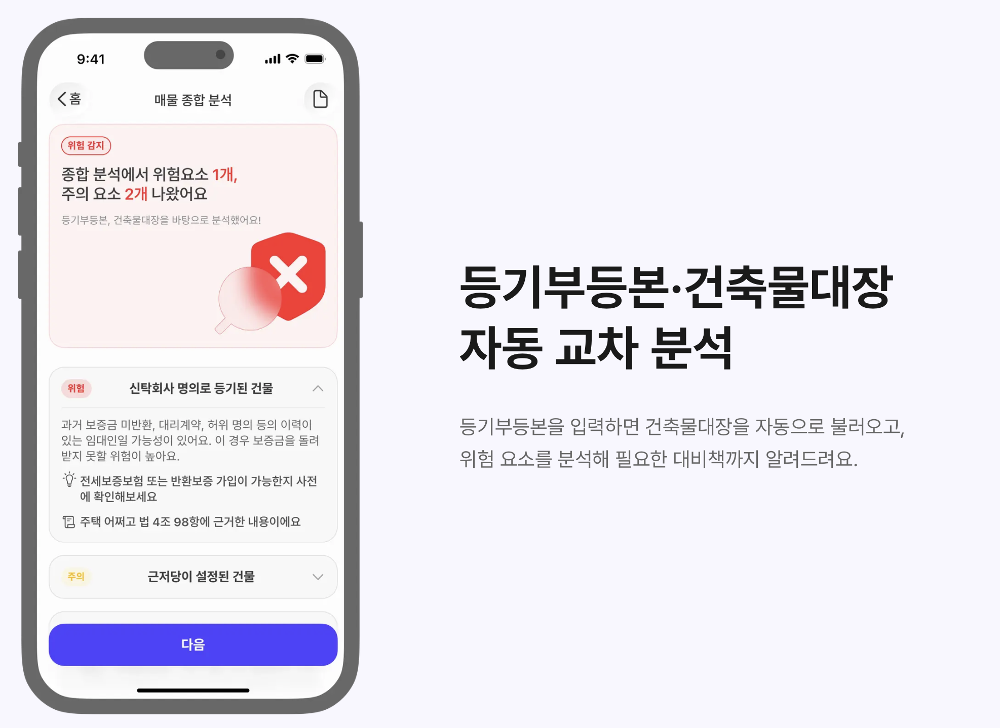
  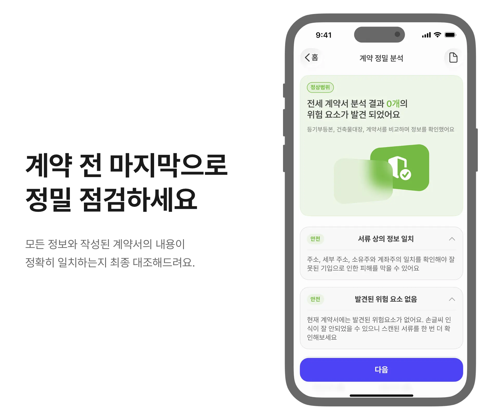

- 목적: 부동산 계약서류 분석으로 경험이 적은 유저의 불안감 해소
- 사용 기술: iOS, Swift, MVVM, AI OCR
- 주요 기능
  - 사용자 서류 OCR
  - 분석 내용을 토대로 사용자에게 필요한 검토 안내
- 기획 배경
  - 전월세 계약에 대한 사회적 불안감 상승
  - 기존 부동산 앱의 단점 보완(계약서 분석 없음)

---

### 2) 의사소통 보조도구 앱 AAC – 이으미

  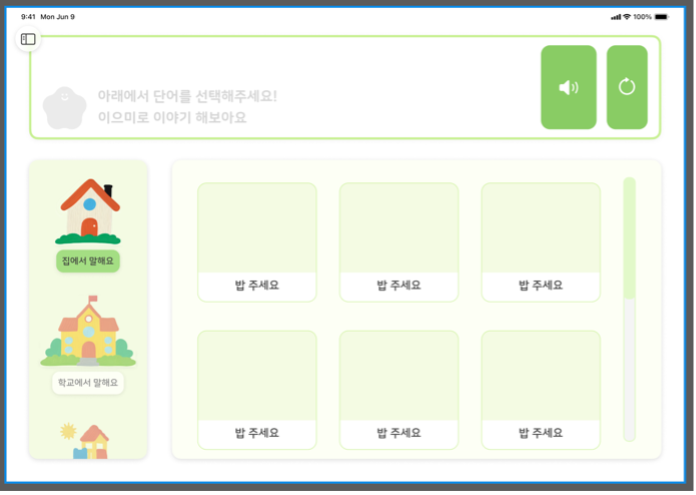
  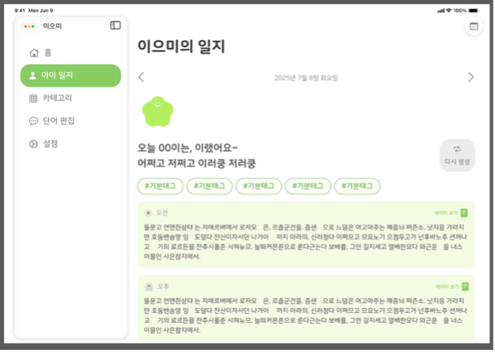

- 목적: 발화가 어려운 자폐성 장애인의 의사소통을 돕는 AAC 앱
- 사용 기술: iOS, Swift, MVVM, Apple On-Device AI
- 주요 기능
  - 사용자 맞춤 커스터마이징을 위한 CRUD
  - 온디바이스 인공지능(Apple Intelligence) 기반 보조
  - 발화 내용을 바탕으로 한 생성형 일기 제작
- 기획 배경
  - 물리적 AAC의 휴대성 한계
  - 기존 AAC 앱의 감정/마음 상태 표현 및 일기 기능 부재

---

### 3) 지켜줄Cam – 개인정보 보호 카메라

  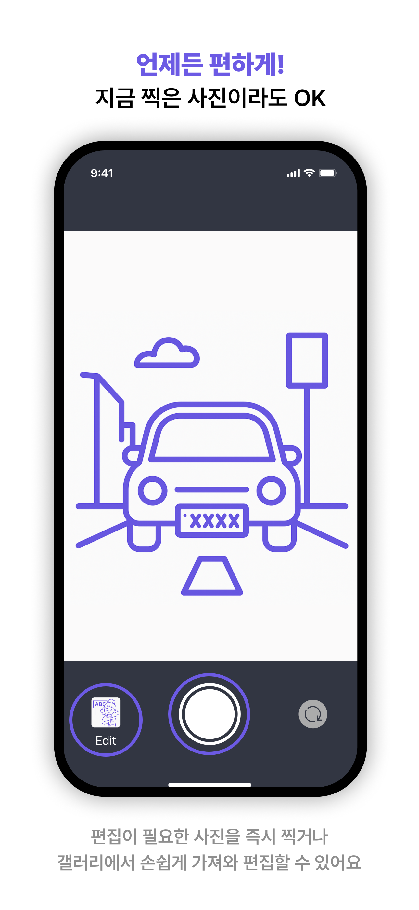
  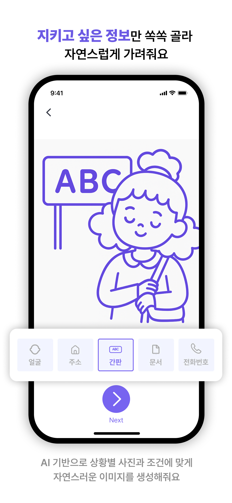

- 목적: 원클릭으로 개인정보를 보호하는 사진 편집 앱
- 사용 기술: iOS, Swift, MVVM, Gemini
- 백엔드: Firebase Cloud Run + Python Django로 Gemini 호출 서버 구현
- 특징: 간편한 흐림/가림 처리 UX, 즉시 반영 미리보기

---

### 4) TarotMe – 타로 AI 앱 (미출시)

  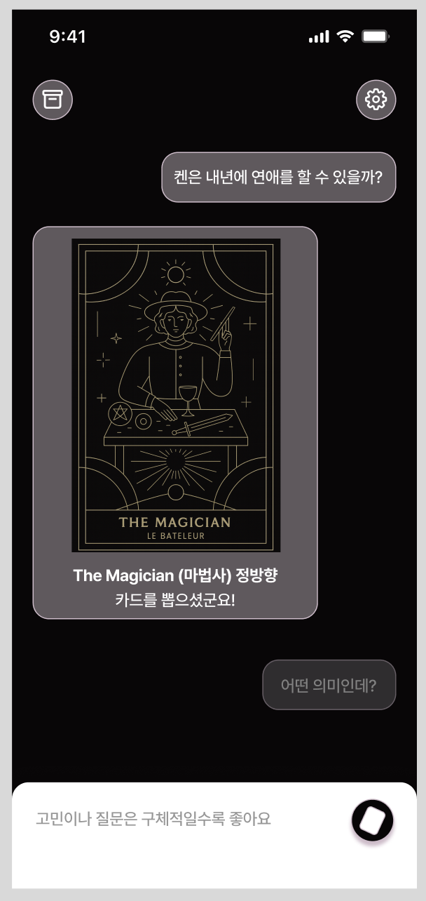
  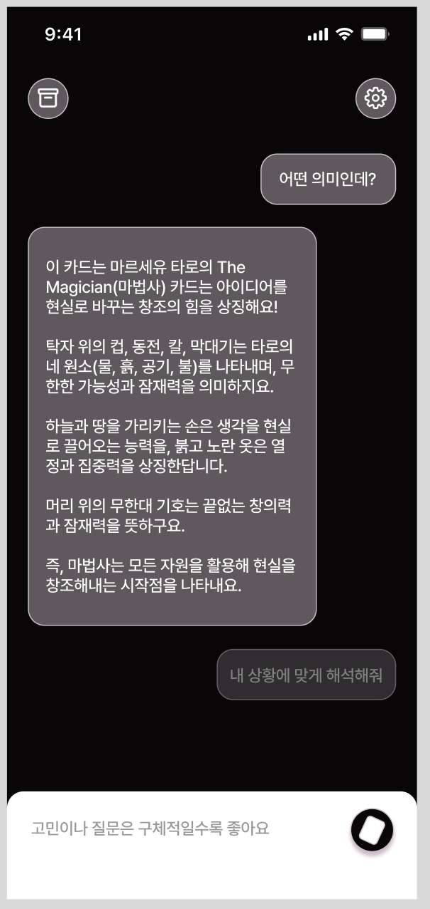

- 목적: 속마음을 표현하기 어려운 사용자를 위한 온디바이스 AI 타로 앱
- 사용 기술: iOS, Swift, MVVM, Apple On-Device AI
- 출시 예정: iOS 26 정식 출시일에 맞춰 공개 예정
- 개발 내용
  - MVVM 적용
  - 온디바이스 인공지능(Apple Intelligence)
  - GPT 연동을 위한 클린 아키텍처 도입
  - iOS 26.0 베타 대응

---

### 5) SR-report
[웹 서비스 바로가기](https://app.koriai.com)

  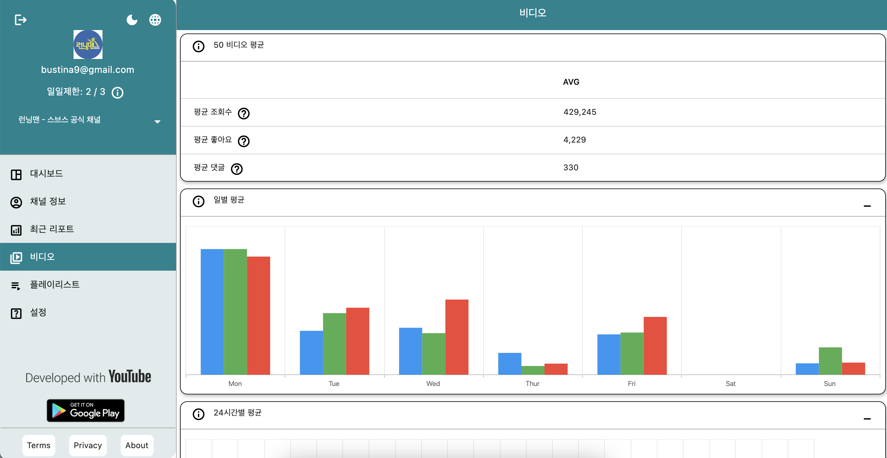

<b>더 많은 스크린샷 보기</b>

  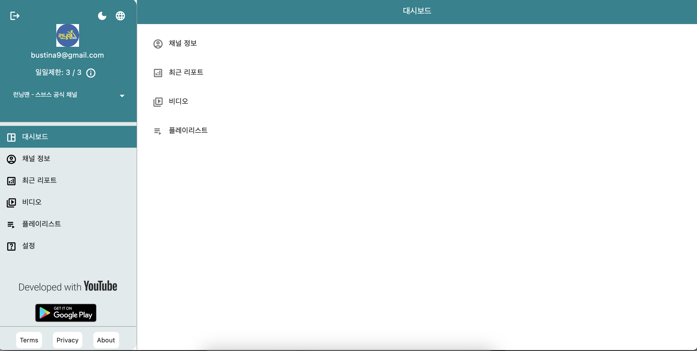
  
  
  
  
  

- 프론트엔드: Flutter  
- 백엔드: Python, Django, Docker  
- 클라우드: Google Cloud, Firebase (Auth, Firestore, Hosting, Functions)  

---

### 6) Total War: WARHAMMER III Roster Simulator
[웹 서비스 바로가기](https://ttw-roster.web.app)

  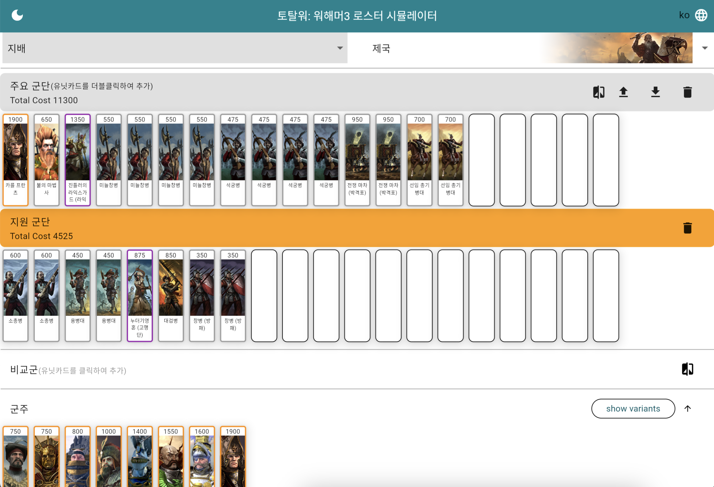

<b>더 많은 스크린샷 보기</b>

  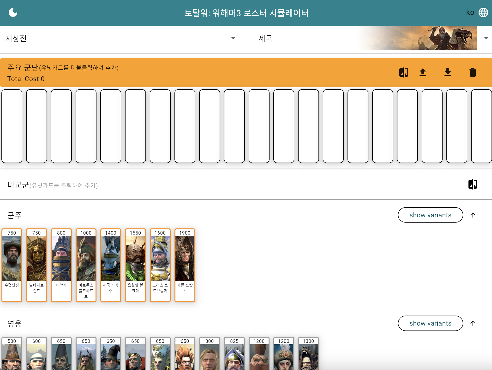
  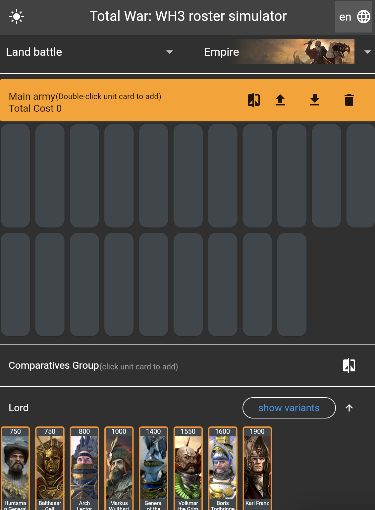
  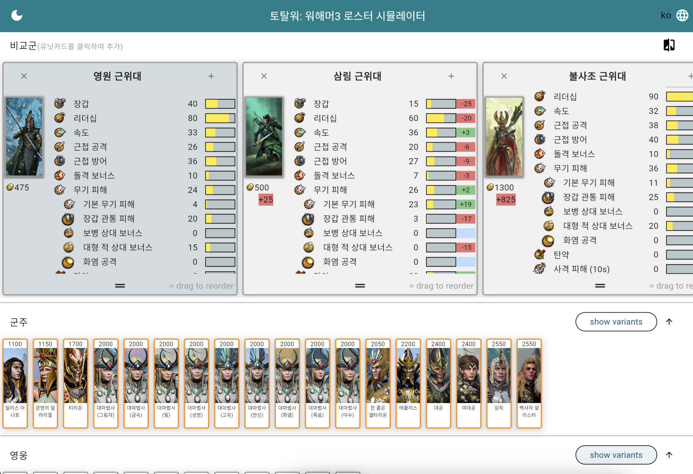

- 프론트엔드: Flutter  
- 백엔드: Python  
- 클라우드: Google Cloud, Firebase Hosting

---

### 7) Clips Viewer
[웹 서비스 바로가기](https://clips-u.web.app)

  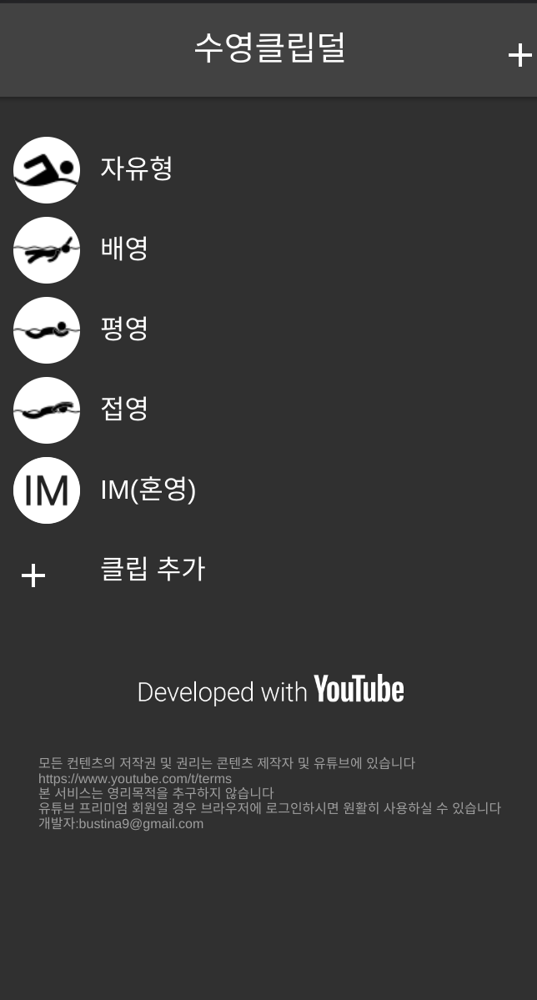
  

- 목적: 유튜브 클립 모아보기
- 프론트엔드: Flutter  
- 클라우드: Firebase (Hosting, Firestore)

## 🗂 Portfolio
- 포트폴리오 페이지: [https://portfolio-khj.web.app](https://portfolio-khj.web.app)

  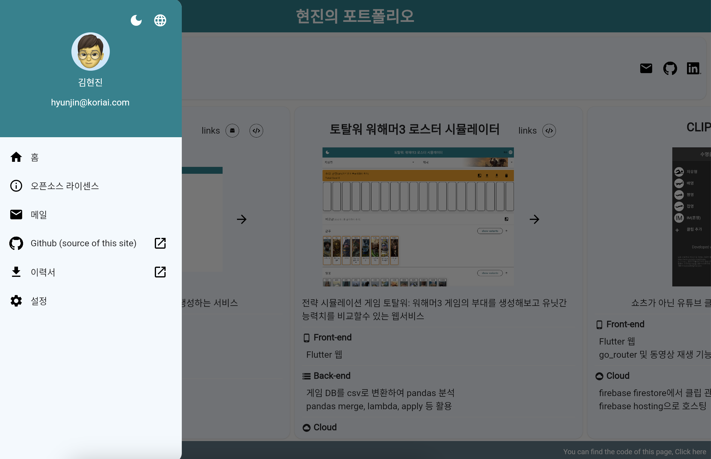

