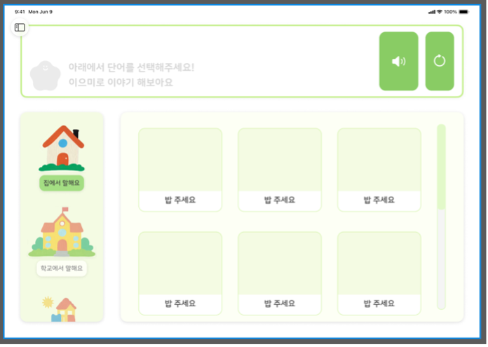
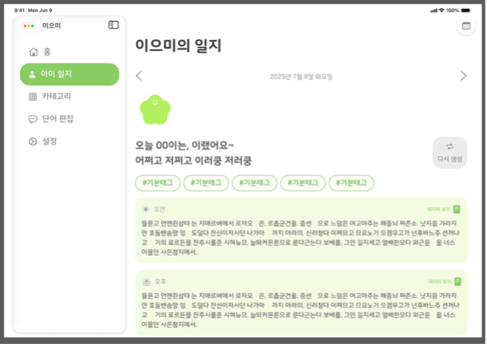
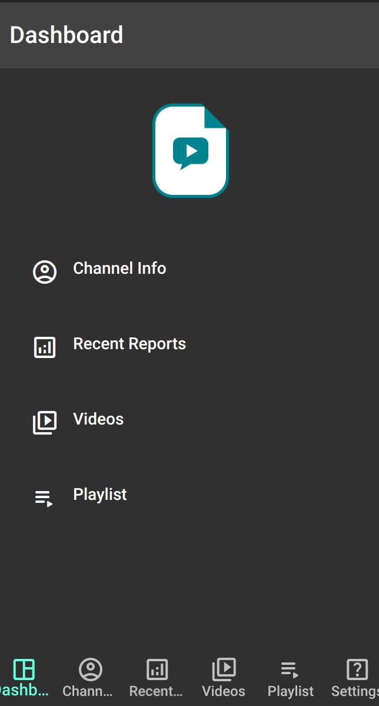
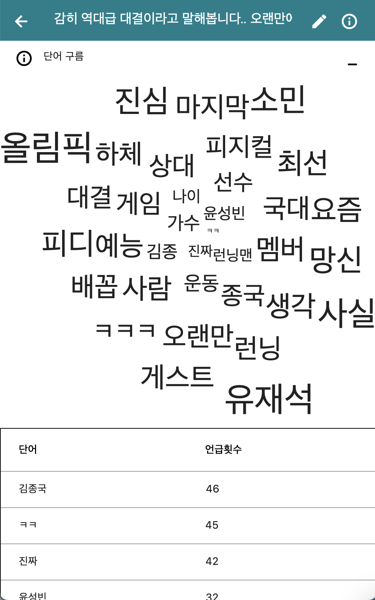
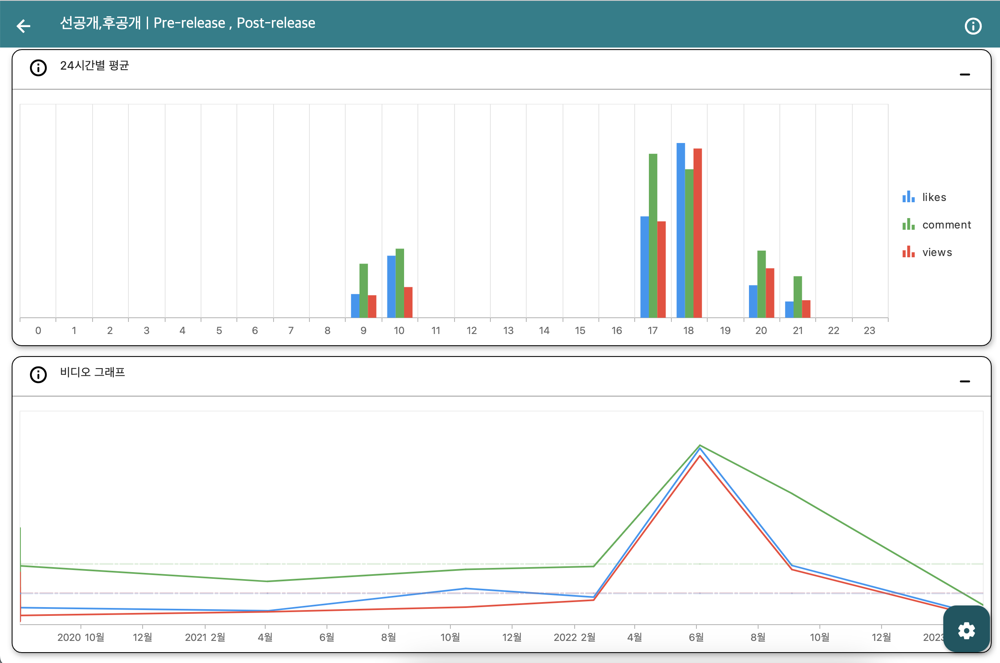
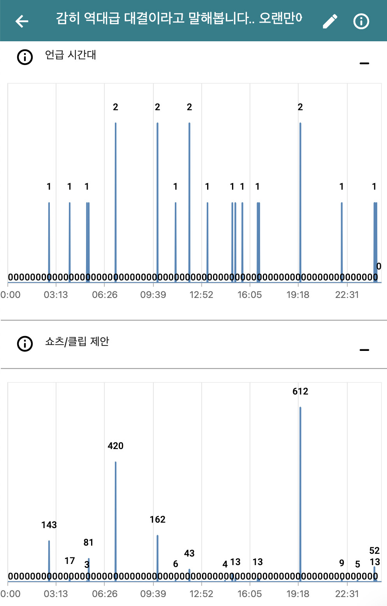
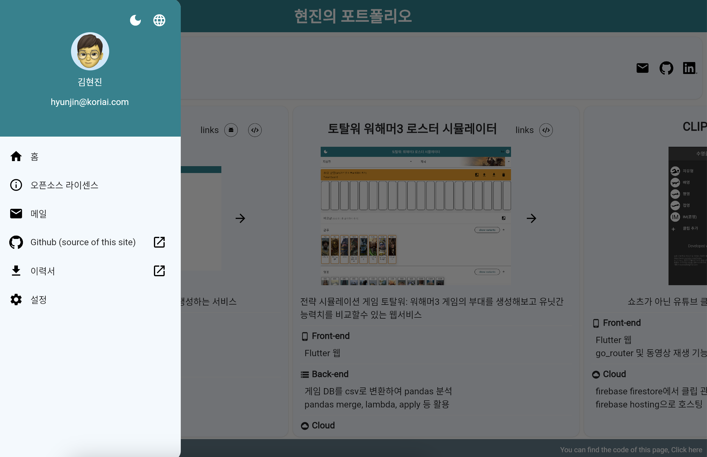

# 😀 Hi, I'm Hyun Jin, Kim

📧  [bustina9@gmail.com](mailto:bustina9@gmail.com) or [hyunjin@koriai.com](mailto:hyunjin@koriai.com)

:house:  Seoul, Republic of Korea

## ☎📱 Contact

## :pencil2: Scholar & Career

Sungkyunkwan-univ : 2009-2015

Samsung Display : 2016-2017

Sungkyunkwan-univ master : 2018-2020

BodyFriend : 2024-2025

Apple Developer Academy : 2025 - present

Kori AI : 2020 - present

## 🔨 Skills

## :books: Projects

### 1. [iOS AAC]

</img>
</img>
1. 앱의 목적: [발화가 어려운 자폐장애인]들이 [의사소통]을 [AAC앱]을 활용하도록 도와서 [의사 소통 및 마음건강을 더 좋게] 도와줄 앱
2. 사용된 기술: Apple On-Device AI, MVVM
3. 출시예정일: iOS26 정식 출시일
4. 기획
   1) 기존 물리적 AAC는 부피가 더 크기 떄문에 이동 시 불편함
   2) 기존 AAC 앱은 발화 내용을 토대로 한 생성형 일기 제작이 없고, 마음상태를 보여주기 위한 기능이 없음 
5. 개발과정
   1) 사용자 커스터마이징을 위한 CRUD
   2) OnDevice-인공지능 (Apple Intelligence)
   3) GPT-연동을 위한 클린 아키텍쳐 도입
   4) iOS 26.0 beta 대응 개발
    

### 2. [Tarot]

1. 앱의 목적: 속마음을 내보이기 어려운 사람들을 위한 온바이스 ai 타로앱
2. 사용된 기술: Apple On-Device AI, MVVM
3. 출시예정일: iOS26 정식 출시일
4. 기획
   1) Apple Intelligence 학습을 위함
   2) 팀원이 좋아하는 분야, 장르
6. 개발과정
   1) MVVM
   2) OnDevice-인공지능 (Apple Intelligence)
   3) GPT-연동을 위한 클린 아키텍쳐 도입
   4) iOS 26.0 beta 대응 개발

### 3. [SR-report](https://app.koriai.com)

</img>

 <b>More screencasts</b>

## Screencasts

</img>
</img>
</img>
</img>
</img>
</img>

1. front-end: Flutter
2. back-end: Python, Django, Docker
3. cloud: Google Cloud, Firebase (auth, firestore, hosting, functions)

### 4. [Total war:warhammer3 roster simulator](https://ttw-roster.web.app)

</img>

 <b>More screencasts</b> 

## Screencasts

</img>
</img>
</img>

1. front-end: Flutter
2. back-end: Python
3. cloud: Google Cloud, Firebase hosting

### 5. [Clips viewer](https://clips-u.web.app)

</img>
</img>

This project provides the clips of youtubes.

1. front-end: Flutter
2. cloud: Firebase (hosting, firestore)

# :memo: [Portfolio Page](https://portfolio-khj.web.app)

</img>
